

  

  <b>🌐 WatchAlert —— 云原生环境下的轻量级智能监控告警引擎</b>

## 💎 WatchAlert 是什么？
🎯 **专注可观测性与稳定性，为运维提效降本**

WatchAlert 是一款专为云原生环境设计 的轻量级监控告警引擎，聚焦于可观测性（Metrics、Logs、Traces）与系统稳定性保障，提供从采集、分析到告警的全链路解决方案 。

🔍 **AI 智能加持，让告警更有“洞察力”**

通过 AI 技术深度分析 Metrics、Logs 和 Traces 中的异常信号，精准定位根因，智能生成排查建议与修复方案，显著提升故障响应效率。

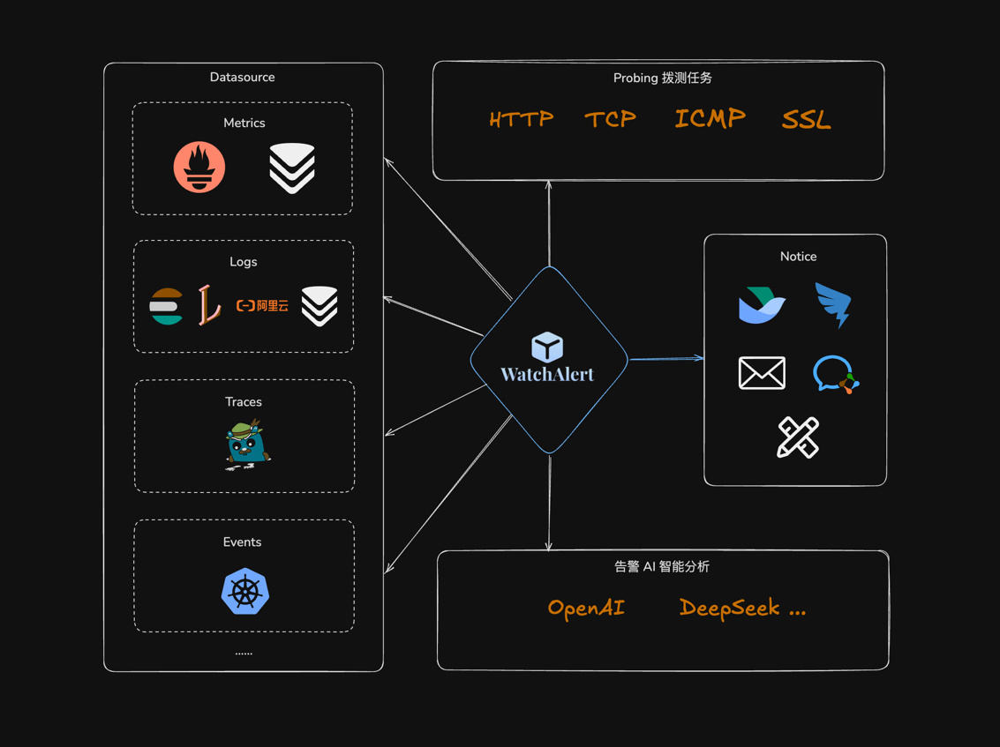

## 🧩 全面兼容主流可观测技术栈

|  监控类型   | 支持的数据源                                                                                    |
|:-------:|-------------------------------------------------------------------------------------------|
| Metrics | Prometheus、VictoriaMetrics                                                                |
|  Logs   | Loki、ElasticSearch、VictoriaLogs、ClickHouse、SLS（阿里云日志服务）、TLS（火山云日志服务，开发中）、CLS（腾讯云日志服务，开发中） |
| Traces  | Jaeger                                                                                    |
| Events  | Kubernetes 事件监控                                                                           |
|  网络拨测   | HTTP、ICMP、TCP、SSL                                                                         |
|  通知渠道   | 飞书、钉钉、企业微信、邮件、自定义 Webhook、Slack                                                           |

## 🔍 核心亮点

🧠 **AI 智能分析**

- 基于 AI 技术对告警内容进行深度语义解析，自动识别异常模式
- 提供根因推测、排查建议与修复思路，让每一次告警都“言之有物”

🕰️ **完善的值班机制**
- 支持轮班排班、节假日调整、值班交接等场景
- 告警通知精准匹配责任人，确保第一时间响应

⚡ **告警升级机制**
- 多级告警策略配置：从首次触发到升级通知，层层保障不漏报
- 支持超时重试、通知升级、负责人转接等功能，保障告警闭环处理

📊 **Namespace 级告警分类**
- 支持以命名空间（Namespace）为单位进行告警分组管理
- 清晰分类，快速定位，大幅提升故障处理效率

## 🚀 技术栈
- 后端环境要求
  - Go >= `1.23`

  - `Go`、`Gin`、`Viper` 、`Gorm`、`JWT`、`Go-zero`...

- 前端环境要求
  - Node.js >= `v18.20.3`
  - Yarn >= `1.22.22`
  - `React`、`JSX`、`Ant-design`、`Codemirror`...

## 📚 项目文档

- 功能介绍：https://cairry.github.io/docs/
- 快速部署：https://cairry.github.io/docs/install/docker.html

## 🎉 项目预览
- 演示环境：http://183.92.128.112:45639
  （admin/123）

| 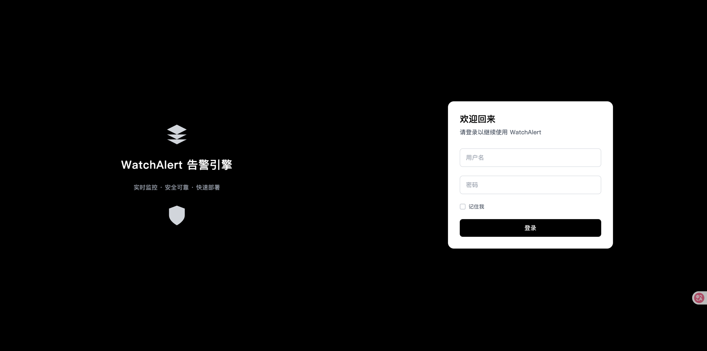 | 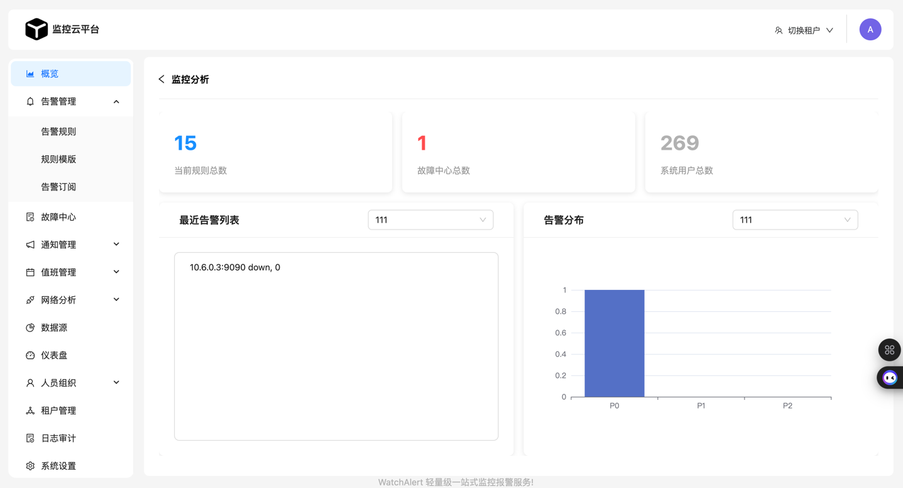            |
|:--------------------------:|------------------------------|
|    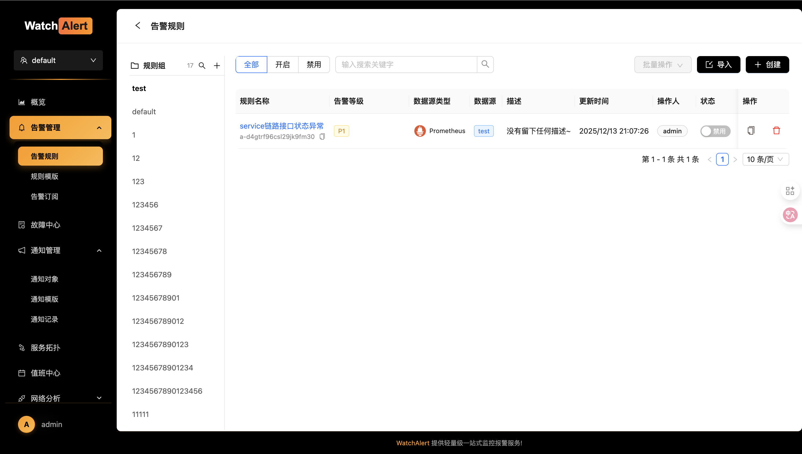     | 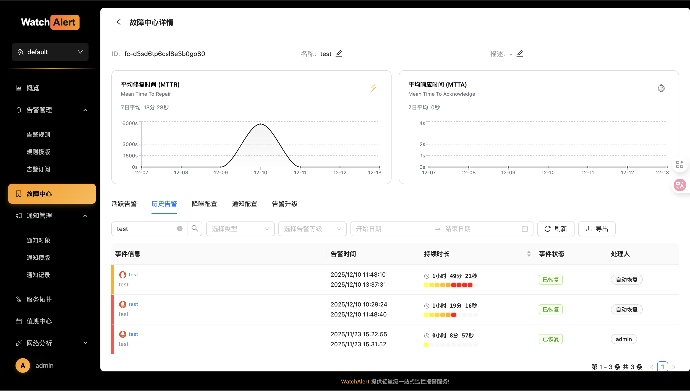  |
|   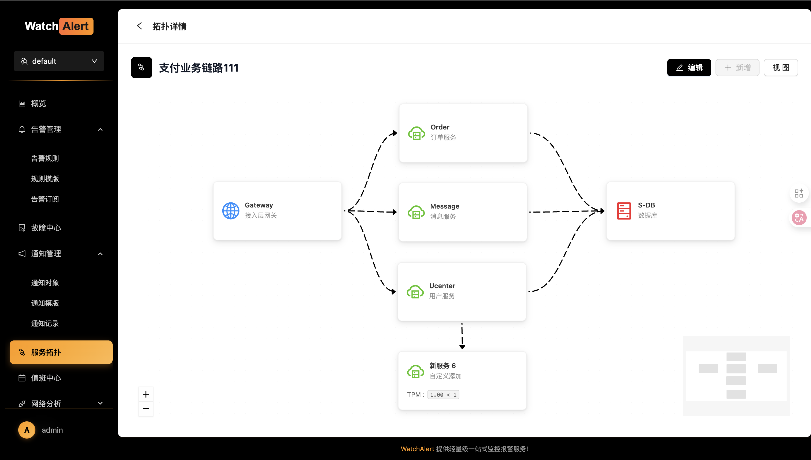    | 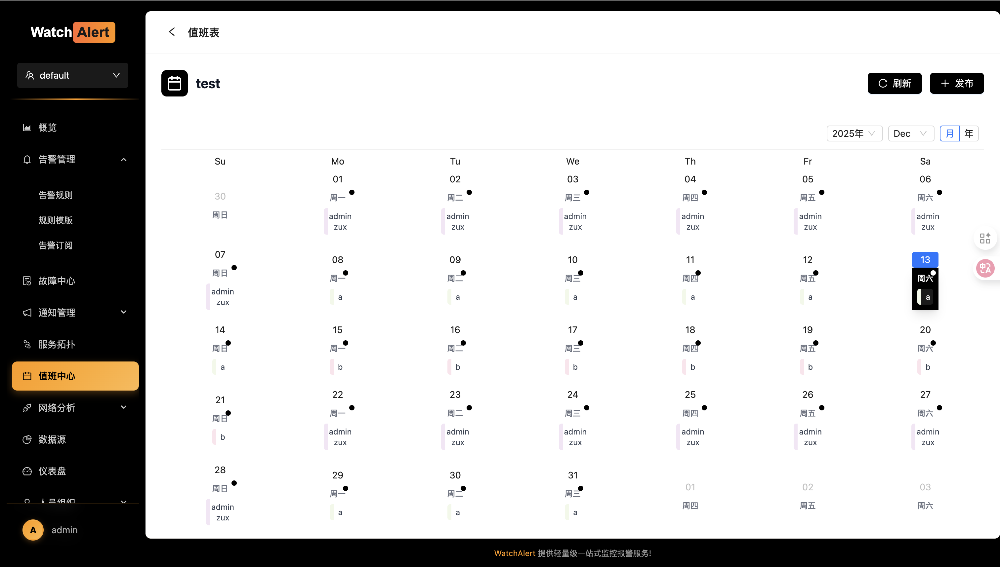           |
|  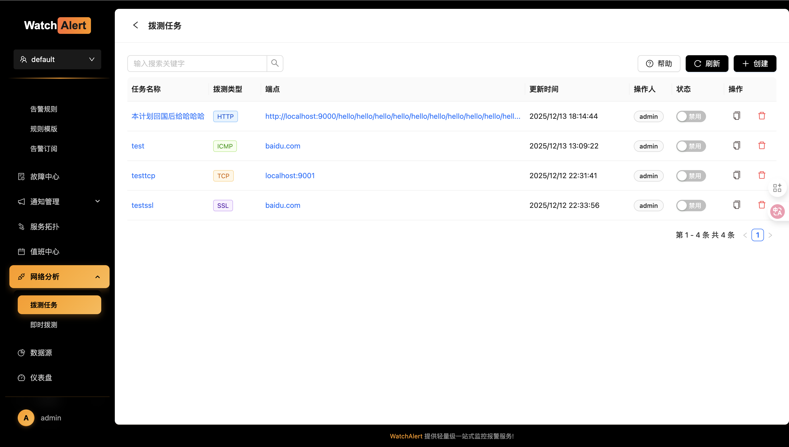   | 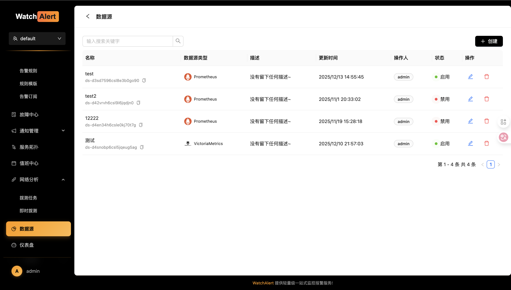|
|   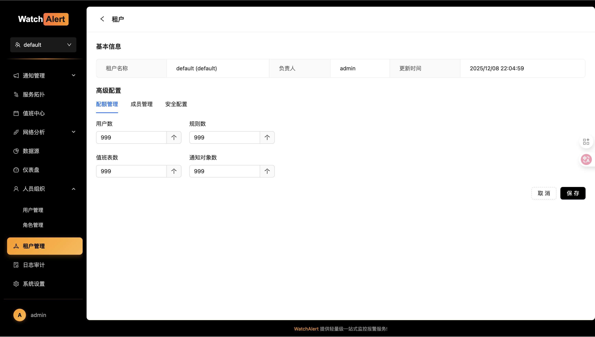      | 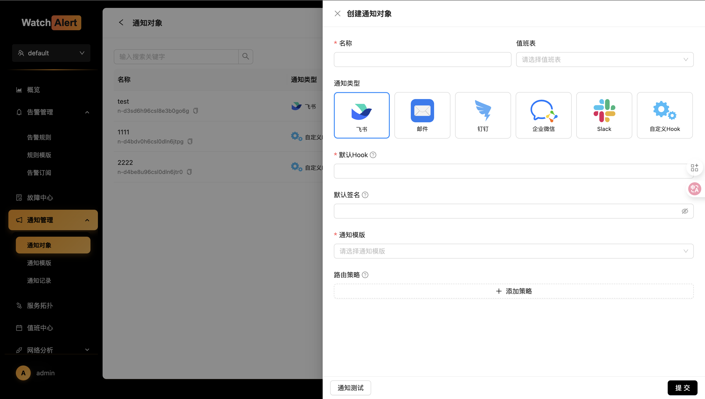             |

## 🏆 感谢赞助者

感谢以下朋友对 WatchAlert 项目的支持与赞助：
| 赞助人 |   价值  |  
|:-------:|:-------:|
| 蜘蛛侠 | ¥168.09 |
| 迷吧 | ¥133.32 |
| 予清 | ¥100 |
| J. | 一台服务器 |
| srebro | ¥100 |
| 刘亦菲-许昌分菲 | ¥20 |
| DoubleDouble | ¥8 |
| 大白、同学 | ¥10 |
| 三味线 | ¥10 |

> 💝 如果你也想出现在这里，欢迎通过上方赞赏按钮进行打赏，并在备注中留下你的 GitHub 用户名或昵称！

## 🎸 支持
- 如果你觉得 WatchAlert 还不错，可以通过 Star 来表示你的喜欢
- 在公司或个人项目中使用 WatchAlert，并帮忙推广给伙伴使用

## 🧑‍💻 交流渠道
- [点击我](https://cairry.github.io/docs/#%E4%BA%A4%E6%B5%81%E7%BE%A4-%E8%81%94%E7%B3%BB%E6%88%91)